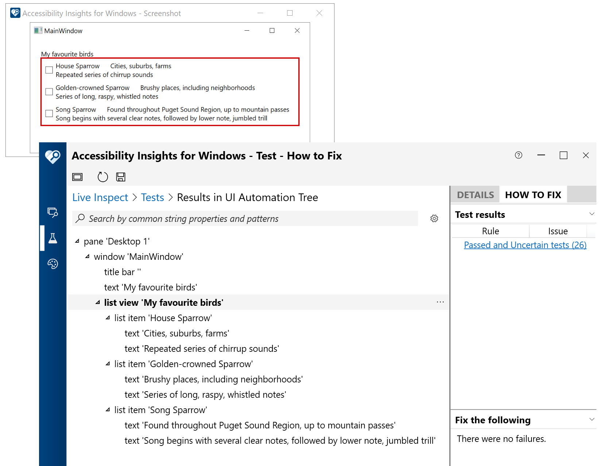
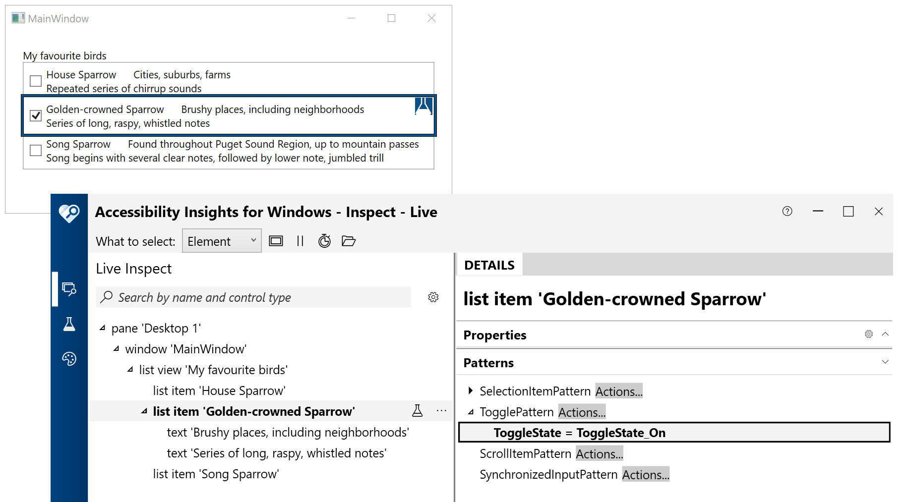
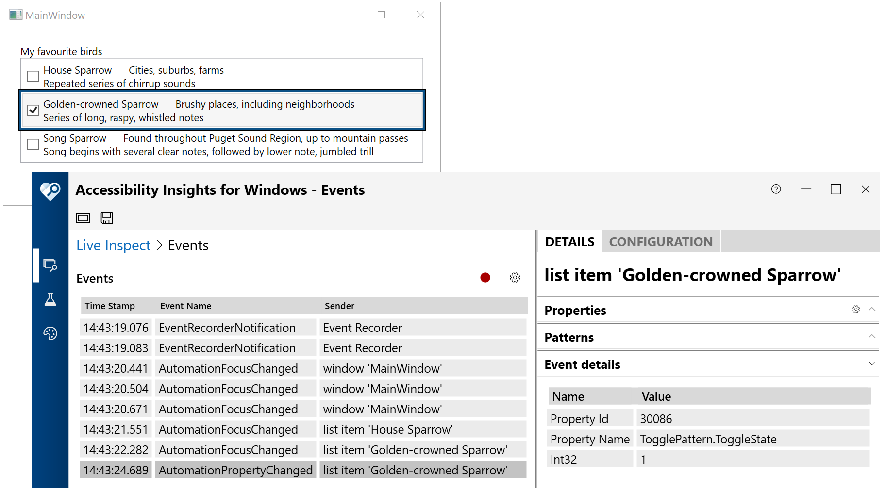
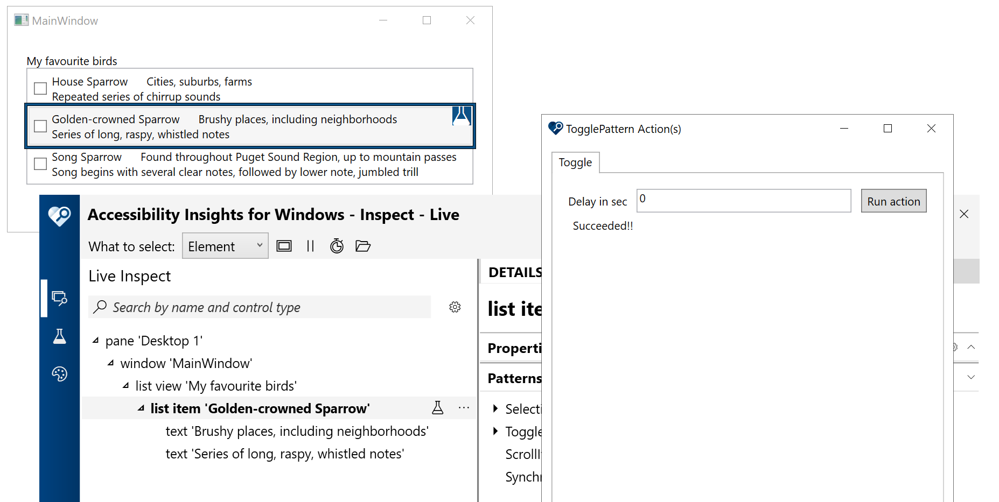

This WPF demo app shows one way of building a list containing accessible toggleable items. Each item in the list contains a checkbox, and the checked state of the checkbox has two-way binding with a custom property on the item. The AutomationPeer providing the accessibility for the item is customized to support the UIA Toggle pattern. Given that all the customer needs relating to the toggled state of the item can be programmatically accessed through the item itself, the contained checkbox has been intentionally hidden from the accessible representation of the UI.

The accessible name of each item is bound to the first text string shown on the element. The app specifically exposes as accessible children of the item, the additional text strings which are not part of the name. So when using the NVDA screen reader, the screen reader's navigation commands can be used to move to those other text strings in each item.

The item's toggled state can be changed by (i) arrowing to the item and pressing Space, (ii) clicking with the mouse anywhere on the item, or (iii) programmatically changing the toggle state using the Accessibility Insights for Windows tool. However the toggle state is changed, the item raises a UIA ToggleState property changed event.

